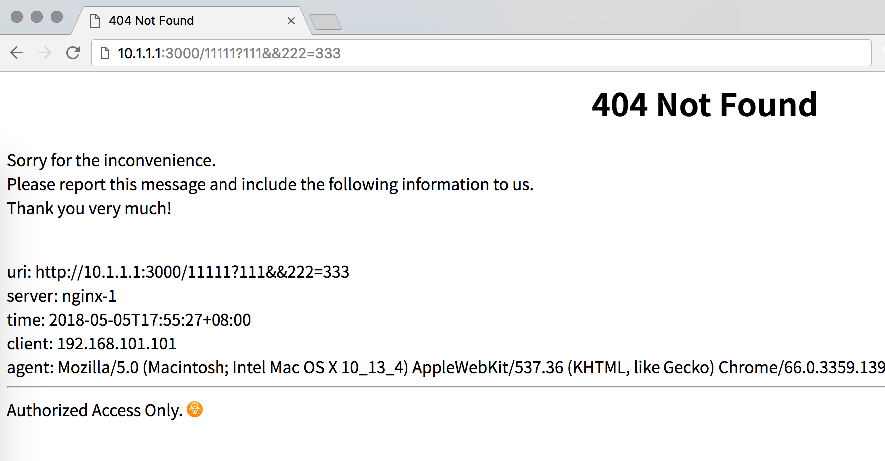

# ngx_friendly
nginx friendly error page.



## Compatibility
* Nginx
  * 1.14.x (last tested: 1.14.0)
  * 1.13.x (last tested: 1.13.6)

Earlier versions is not tested.

## How to use
```
cd nginx-1.13.6
wget -c https://raw.githubusercontent.com/taomaree/ngx_friendly/master/ngx_friendly.patch
patch -p0 < ngx_friendly.patch
./configure
make 
sudo make install
```

## Contribute
Any help would be appreciated! Especially someone could turn this patch into an nginx module.

## License
ngx_friendly is [BSD licensed](./LICENSE).

## Credits
This project inspired by and forked from [Tengine](https://github.com/alibaba/tengine/blob/master/src/http/ngx_http_special_response.c).
